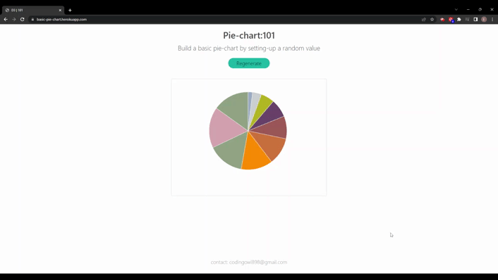

## Pie-chart : Basic

Generated random dataset that reflect using pie-chart 🍕📊
 

  
 
 

## Demo
[Link for basic pie-chart](https://basic-pie-chart.herokuapp.com/)
 

## Feedback
***If you have any feedback feel free to contact me at,*** codingowl898@gmail.com
 
 

## Reference

D3

...

 

## License
All rights reserved. Under the MIT license.

